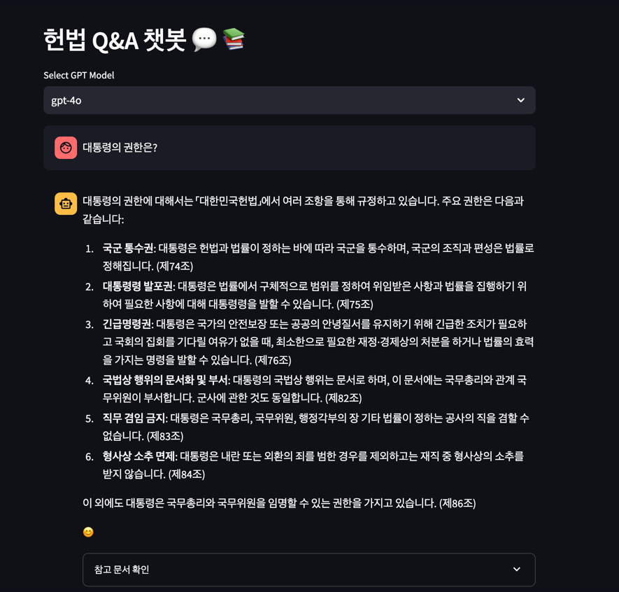

# 사용 기술
- python 3.10
- streamlit
- langchain (with OpenAI)
- Chroma (벡터 DB)
# 실행 방법
1. `pip install -r requirements.txt`
2. .env 파일 생성 후 openai api key 입력
   3. ```
      OPENAI_API_KEY={YOUR_API_KEY}
2. `streamlit run memory.py` 실행

# 실행 화면


# model flow
## 1. model 선택
입력을 통해 사용자가 원하는 모델을 선택

## 2. 문서 분할 및 벡터 모델링
- 대한민국 헌법.pdf 을 분할
- chunk_size=500, chunk_overlap=50 으로 분할
- text-embedding-3-small 을 통해 문서의 각 chunk에 대한 벡터 생성
- 생성된 벡터를 Chroma에 저장

## 3. retriever 생성
- search_kwargs={"k": 3} 으로 retriever 생성
- create_history_aware_retriever 을 통해 history-aware retriever 생성
  - 이전 대화 내용(history)와 사용자 입력(input) 을 통해 질문 생성
  - 질문에 대한 context 를 고려해 더 적합한 문서를 찾기 위함임.

## 4. prompt 와 llm 으로 langchain 생성
- prompt, llm, retriever 를 통해 langchain 생성

# 질문 시
1. history 와 input 으로 문서 검색
2. 검색된 문서를 통해 langchain 에서 답변 생성 및 반환
3. history 저장

